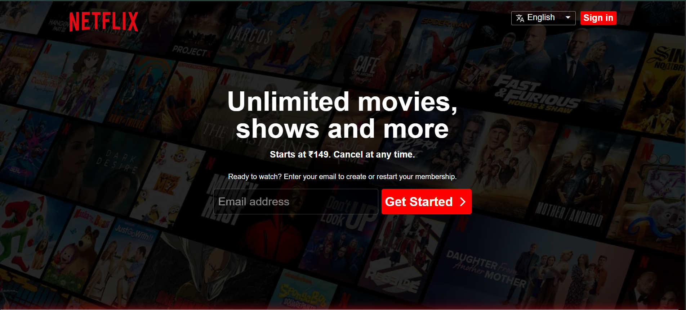

# 🎬 Netflix India Clone

A pixel-perfect, fully responsive **Netflix India** landing page clone built with pure **HTML** and **CSS** — no frameworks, no JavaScript libraries. Designed to look and feel exactly like the real Netflix homepage.

---

## 🖼️ Preview




---

## 🚀 Live Demo

Open `index.html` in any modern browser to view the project locally.

---

## ✨ Features

- ✅ **Hero Section** — Full-screen background with dark overlay, tagline, and email CTA
- ✅ **Netflix Navigation Bar** — Logo, language selector, and Sign In button
- ✅ **Trending Now Section** — Horizontal movie cards with smooth hover zoom effect
- ✅ **More Reasons to Join** — Four feature cards (TV, Download, Multi-device, Kids)
- ✅ **FAQ Section** — Accordion-style Frequently Asked Questions
- ✅ **Footer** — Multi-column links, language selector, reCAPTCHA notice
- ✅ **Red Glowing Divider** — Custom animated Netflix-style divider


---

## 🛠️ Tech Stack

| Technology | Usage |
|------------|-------|
| **HTML5** | Page structure and semantic markup |
| **CSS3** | Styling, animations, hover effects |
| **Google Fonts** | Roboto font family |
| **Netflix Font CDN** | Netflix Sans font |
| **Google Material Symbols** | Icons (language, arrow) |

---

## 📁 Project Structure

```
NetflixClone/
│
├── index.html          # Main HTML page
├── style.css           # Primary stylesheet
├── styles.css          # Responsive/enhanced stylesheet
│
└── Media/              # All assets (images & icons)
    ├── logo2.png           # Netflix logo
    ├── background.jpg      # Hero section background
    ├── black.jpg           # Footer background
    ├── 1.jpg - 5.jpg       # Trending movie posters
    ├── box1.png            # TV icon
    ├── box3.png            # Multi-device icon
    ├── box4.png            # Kids profile icon
    ├── box5-removebg-preview.png  # Download icon
    ├── add.svg             # FAQ expand icon
    └── translate_24dp_....svg     # Language icon
```

---

## 📸 Sections Breakdown

### 🔝 Header / Navbar
- Netflix logo on the left
- Language dropdown with globe icon on the right
- Red **Sign In** button

### 🌟 Hero / Main Section
- Full-screen background image with 80% black overlay
- Headline: *"Unlimited movies, shows and more"*
- Subtext with pricing and email CTA
- Email input + **Get Started** button

### 🎥 Trending Now
- 5 movie poster cards displayed in a horizontal row
- Smooth **scale-up on hover** animation

### 📦 More Reasons to Join
- 4 feature cards with gradient backgrounds (`#0a0618 → #5a144f`)
- Icons anchored to the bottom-right of each card
- Hover effects with **red glow box-shadow**

### ❓ FAQ Section
- 6 FAQ items styled as dark accordion rows
- Plus icon on the right of each row
- Hover highlight effect

### 🔗 Footer
- Email signup repeat section
- 4-column link grid (FAQ, Help Centre, Account, Media Centre, etc.)
- Language selector button
- Google reCAPTCHA notice

---

## 🎨 Design Highlights

- **Color Palette**: Netflix Red `#e50914`, Deep Black `#141414`, Dark Purple gradient
- **Typography**: Netflix Sans + Roboto
- **Overlays**: `rgba(0,0,0,0.8)` dark overlays on all background images
- **Hover Animations**: Scale, glow, color transitions using CSS `transition`
- **Divider Effect**: Red glowing line with `box-shadow` and `rotateX` transform

---

## 📱 Responsive Breakpoints

| Breakpoint | Target |
|------------|--------|
| `≤ 992px` | Tablets |
| `≤ 768px` | Small Tablets |
| `≤ 600px` | Mobile Phones |
| `≤ 480px` | Small Mobile |

---

## 🏃 How to Run

1. Clone or download this repository
2. Open the project folder
3. Double-click `index.html` **or** run with VS Code Live Server

```bash
# Or use VS Code Live Server extension
# Right-click index.html → "Open with Live Server"
```

---

## 👨‍💻 Author

**Ritik Yadav**
- GitHub: [@Ritikyadav2004](https://github.com/Ritikyadav2004)

---

## 📄 License

This project is for **educational purposes only**. All Netflix branding, logos, and trademarks belong to **Netflix, Inc.**

---

> ⭐ If you liked this project, don't forget to give it a star on GitHub!
